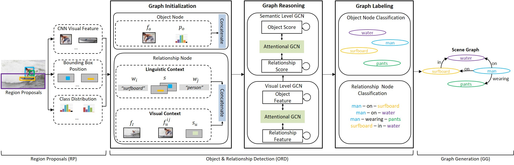

# GraphRCNN

2020 춘계학술대회 논문집(제27권 제1호) p555~558

[그래프 신경망과 멀티 모달 맥락 정보를 이용한 장면 그래프 생성(Scene Graph Generation with Graph Neural Network and Multimodal Context)](http://kips.or.kr/bbs/confn/article/1303)

- - -

## Model

## keywords
- Scene Graph Generation
- Relationship Detection
- Multimodal Context
- Deep Neural Network

